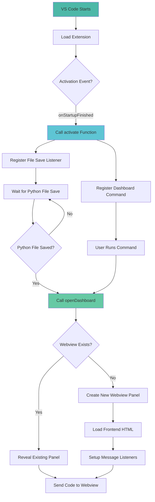
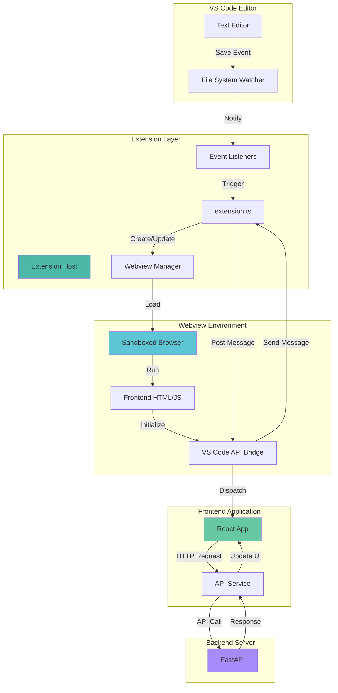

# VS Code Extension Documentation - ABCode

## Table of Contents
1. [Overview](#overview)
2. [Technology Stack](#technology-stack)
3. [Extension Structure](#extension-structure)
4. [Extension Lifecycle](#extension-lifecycle)
5. [Webview Integration](#webview-integration)
6. [Communication Protocol](#communication-protocol)
7. [Build & Packaging](#build--packaging)
8. [Architecture Diagram](#architecture-diagram)

---

## Overview

The ABCode VS Code Extension is the **bridge component** that connects VS Code's editor environment with the frontend webview application. It monitors Python file saves, captures code content, and displays an interactive analysis dashboard in a webview panel.

### What is the Extension?

The extension is a **VS Code plugin** that:

- **Monitors file save events** in the VS Code editor
- **Captures active Python code** when files are saved
- **Creates webview panels** to display the frontend UI
- **Facilitates bidirectional communication** between VS Code and the webview
- **Manages webview lifecycle** (creation, disposal, reuse)
- **Handles resource URIs** for assets in the webview environment
- **Provides commands** for manual dashboard opening

The extension acts as a **lightweight orchestrator** that enables seamless integration between VS Code's native environment and the web-based frontend application.

---

## Technology Stack

### Core Technologies

| Technology | Version | Purpose |
|------------|---------|---------|
| **TypeScript** | 5.9.3 | Type-safe extension development |
| **VS Code Extension API** | 1.105.0 | Official API for VS Code integration |
| **Node.js** | 22.x | Runtime environment |
| **Webpack** | 5.102.0 | Module bundler for production builds |

### Build Tools

| Tool | Purpose |
|------|---------|
| **ts-loader** | TypeScript compilation for Webpack |
| **webpack-cli** | Command-line interface for Webpack |
| **ESLint** | Code linting and quality enforcement |
| **@vscode/test-electron** | Extension testing framework |

---

## Extension Structure

```
final2/
│
├── src/
│   └── extension.ts                    # Main extension entry point
│
├── dist/
│   └── extension.js                    # Compiled output (generated)
│
├── media/                              # Frontend application
│   ├── src/                            # React source code
│   └── dist/                           # Built frontend (loaded by webview)
│       ├── index.html
│       ├── assets/
│       ├── logo.svg
│       └── analysis.svg
│
├── package.json                        # Extension manifest
├── webpack.config.js                   # Webpack configuration
├── tsconfig.json                       # TypeScript configuration
├── .vscodeignore                       # Files excluded from package
└── README.md                           # Extension documentation
```

### Key Files

#### 1. **extension.ts** (Main Extension Logic)

**Location**: `src/extension.ts`

**Purpose**: Entry point that defines extension behavior

**Exports**:
- `activate(context)`: Called when extension is activated
- `deactivate()`: Called when extension is deactivated

**Key Functions**:
- `openDashboard(context)`: Creates/shows webview panel
- `getWebviewContent(context, webview)`: Generates HTML for webview
- `isDevServerRunning(url)`: Checks if Vite dev server is running
- `getDevServerHtml()`: Returns HTML for development mode

---

#### 2. **package.json** (Extension Manifest)

**Location**: `package.json`

**Key Configuration**:

**Extension Metadata**:
```json
{
  "name": "abcode-extension",
  "displayName": "ABCode Extension",
  "description": "Shows the ABCode UI when user writes code",
  "version": "0.0.1",
  "publisher": "yourname"
}
```

**Activation Events**:
```json
{
  "activationEvents": ["onStartupFinished"]
}
```
- Extension activates when VS Code finishes startup
- Always active to monitor file saves

**Entry Point**:
```json
{
  "main": "./dist/extension.js"
}
```

**Contributed Commands**:
```json
{
  "contributes": {
    "commands": [
      {
        "command": "abcode-extension.runPythonAndOpen",
        "title": "Run Python and Open Dashboard"
      }
    ]
  }
}
```

---

#### 3. **webpack.config.js** (Build Configuration)

**Target**: `node` (VS Code extensions run in Node.js)

**Entry**: `./src/extension.ts`

**Output**:
- Directory: `dist/`
- Filename: `extension.js`
- Format: CommonJS

**Externals**:
- `vscode` module (provided by VS Code at runtime)

**Loaders**:
- `ts-loader` for TypeScript compilation

---

## Extension Lifecycle

### Activation Flow



### Event Listeners

#### 1. **File Save Listener**

**Trigger**: `vscode.workspace.onDidSaveTextDocument()`

**Condition**: Document language ID is `python`

**Action**: Opens dashboard with current code

**Purpose**: Automatic analysis when user saves Python files

---

#### 2. **Command Registration**

**Command ID**: `abcode.openDashboard`

**Trigger**: User executes command from command palette

**Action**: Opens dashboard with current editor content

**Purpose**: Manual dashboard opening for any language

---

### Deactivation

**Trigger**: VS Code closes or extension is disabled

**Action**: `deactivate()` function called

**Cleanup**:
- Webview panels are disposed automatically
- Event listeners are unregistered
- Resources are freed

---

## Webview Integration

### Webview Panel Creation

**API**: `vscode.window.createWebviewPanel()`

**Configuration**:
```typescript
{
  viewType: 'abcodeDashboard',
  title: 'ABCode Dashboard',
  showOptions: vscode.ViewColumn.Beside,
  options: {
    enableScripts: true,
    retainContextWhenHidden: true,
    localResourceRoots: [vscode.Uri.file(path.join(context.extensionPath, 'media', 'dist'))]
  }
}
```

**Options Explained**:
- `enableScripts`: Allow JavaScript execution in webview
- `retainContextWhenHidden`: Preserve state when panel is hidden
- `localResourceRoots`: Restrict file access to specific directories

---

### HTML Generation Modes

#### 1. **Production Mode** (Default)

**Source**: Loads built files from `media/dist/`

**Process**:
1. Read `dist/index.html`
2. Convert all `src` and `href` paths to webview URIs
3. Add Content Security Policy (CSP) headers
4. Inject VS Code API initialization script
5. Inject SVG asset URIs
6. Return modified HTML

**URI Conversion**:
- Original: `<script src="/assets/index.js"></script>`
- Converted: `<script src="vscode-webview://path-to-extension/media/dist/assets/index.js"></script>`

---

#### 2. **Development Mode**

**Trigger**: Vite dev server running on `http://localhost:5173`

**Method**: Embeds dev server in iframe

**HTML**:
```html
<!DOCTYPE html>
<html lang="en">
<head>
  <meta charset="UTF-8" />
  <meta http-equiv="Content-Security-Policy"
        content="default-src * 'unsafe-inline' 'unsafe-eval' data: blob:;">
  <title>ABCode (Dev Mode)</title>
</head>
<body style="margin:0;padding:0;overflow:hidden">
  <iframe src="http://localhost:5173"
          frameborder="0"
          style="width:100%;height:100vh;"></iframe>
</body>
</html>
```

**Advantages**:
- Hot Module Replacement (HMR)
- Instant updates on code changes
- Better debugging experience

---

### Content Security Policy (CSP)

**Purpose**: Restrict resource loading for security

**Policy**:
```
default-src 'none';
connect-src http://localhost:8000 http://127.0.0.1:8000;
img-src vscode-webview: https: data:;
script-src vscode-webview: 'unsafe-inline';
style-src vscode-webview: 'unsafe-inline' https:;
font-src vscode-webview: https:;
```

**Restrictions**:
- Only allow scripts from webview URI scheme
- Only allow API calls to localhost backend
- Block external resource loading (except images and fonts)
- Allow inline scripts and styles (required for dynamic content)

---

### VS Code API Injection

**Purpose**: Enable communication between webview and extension

**Injected Script**:
```javascript
<script>
  console.log('🟢 INLINE SCRIPT IS RUNNING!');

  // Initialize VS Code API
  if (typeof acquireVsCodeApi !== 'undefined') {
    window.vscodeApi = acquireVsCodeApi();
    console.log('✓ VS Code API initialized');
  } else {
    console.error('✗ acquireVsCodeApi not available');
  }

  // Inject SVG asset URIs
  window.VSCODE_ASSETS = {
    logo: "vscode-webview://path-to-logo.svg",
    analysis: "vscode-webview://path-to-analysis.svg"
  };

  // Listen for messages from extension
  window.addEventListener('message', function(event) {
    console.log('🟢 Received message:', event.data);
  });
</script>
```

**Placement**: Injected immediately after `<body>` tag

**Critical Ordering**:
1. Acquire VS Code API first
2. Then inject asset URIs
3. Set up message listener

**Why This Order Matters**:
- VS Code API must be acquired synchronously on first script execution
- Can only call `acquireVsCodeApi()` once per webview
- Asset URIs depend on API being available

---

## Communication Protocol

### Message Passing Architecture

```mermaid
sequenceDiagram
    participant Extension
    participant Webview
    participant Frontend

    Extension->>Extension: User saves Python file
    Extension->>Extension: Call openDashboard()
    Extension->>Webview: Create/reveal panel
    Webview->>Frontend: Load React app
    Frontend->>Webview: postMessage('webviewReady')
    Webview->>Extension: Forward webviewReady
    Extension->>Webview: postMessage('updateCode', {code, language, fileName})
    Webview->>Frontend: Forward updateCode
    Frontend->>Frontend: Trigger analysis
    Frontend->>Frontend: Display results

    style Extension fill:#4db8a8
    style Webview fill:#5ec5d4
    style Frontend fill:#66c9a4
```

### Extension to Webview

**Method**: `webview.postMessage(data)`

**Message Format**:
```typescript
{
  type: 'updateCode',
  code: string,
  language: string,
  fileName: string
}
```

**Trigger Points**:
1. When webview is first created (after delay)
2. When webview receives 'webviewReady' signal
3. When reusing existing webview panel

**Timing Strategy**:
- Immediate send when reusing panel
- Wait for 'webviewReady' signal when creating new panel
- Fallback timeout of 1500ms

---

### Webview to Extension

**Method**: `vscodeApi.postMessage(data)`

**Message Format**:
```typescript
{
  type: 'webviewReady'
}
```

**Purpose**: Signal that frontend has loaded and is ready to receive data

**Listener Setup**:
```typescript
webview.onDidReceiveMessage(
  message => {
    if (message.type === 'webviewReady') {
      console.log('Webview ready, sending code...');
      sendCodeToWebview();
    }
  }
);
```

---

### Data Flow Example: Python File Save

**Step-by-Step**:

1. **User Action**: Saves `example.py` in VS Code
2. **Extension Listener**: `onDidSaveTextDocument` fires
3. **Check Language**: Verify `document.languageId === 'python'`
4. **Extract Data**:
   - Code: `editor.document.getText()`
   - Language: `editor.document.languageId`
   - Filename: `path.basename(editor.document.fileName)`
5. **Open Dashboard**: Call `openDashboard(context)`
6. **Check Panel**:
   - If exists: Reveal and send immediately
   - If new: Create panel and wait for ready signal
7. **Send Message**: `postMessage({ type: 'updateCode', code, language, fileName })`
8. **Webview Receives**: Frontend `message` event listener triggers
9. **Frontend Updates**: React state updates with new code
10. **Analysis Triggers**: `useEffect` hook calls backend API
11. **Results Display**: Corrected code, errors, and recommendations shown

---

## Build & Packaging

### Development Workflow

**1. Install Dependencies**:
```bash
npm install
```

**2. Compile Extension**:
```bash
npm run compile
```
- Compiles TypeScript to JavaScript
- Outputs to `dist/extension.js`
- Includes source maps for debugging

**3. Watch Mode**:
```bash
npm run watch
```
- Auto-recompile on file changes
- Faster development iteration

**4. Run in Development**:
- Press `F5` in VS Code
- Opens Extension Development Host
- Loads extension for testing

---

### Production Build

**1. Build Frontend**:
```bash
cd media
npm run build
```
- Compiles React app to `media/dist/`

**2. Package Extension**:
```bash
npm run package
```
- Compiles in production mode
- Minifies code
- Removes source maps
- Outputs to `dist/extension.js`

**3. Create VSIX Package**:
```bash
vsce package
```
- Creates `.vsix` file for distribution
- Includes only necessary files (excludes `node_modules`, source code)
- Ready for installation or marketplace upload

---

### File Size Optimization

**Webpack Configuration**:
- Mode: `production` for packaging
- Tree shaking: Removes unused code
- Minification: Reduces file size
- Source maps: Hidden in production

**Bundle Size**:
- Extension bundle: ~10 KB (compressed)
- Frontend bundle: ~340 KB (loaded separately)

---

## Architecture Diagram

### Component Interaction



### Extension Responsibilities

| Layer | Responsibility |
|-------|----------------|
| **VS Code Editor** | User interaction, code editing, file management |
| **Extension Host** | Run extension code, manage lifecycle, provide APIs |
| **Webview Manager** | Create panels, manage lifecycle, handle disposal |
| **Webview Environment** | Sandboxed browser with restricted permissions |
| **Frontend Application** | User interface, business logic, state management |
| **Backend Server** | Data persistence, AI processing, authentication |

---

## Security Considerations

### Webview Sandboxing

**Isolation**:
- Webview runs in separate process
- No direct access to VS Code APIs (only via message passing)
- Cannot access file system directly
- Cannot execute VS Code commands

**Resource Restrictions**:
- Only load resources from `localResourceRoots`
- CSP prevents loading external scripts
- No eval() or similar dynamic code execution (unless explicitly allowed)

---

### Data Transmission

**Code Content**:
- User's code is transmitted through message passing
- No direct file system access from webview
- Code is temporarily stored in memory

**API Credentials**:
- JWT tokens stored in webview localStorage
- Not accessible to extension
- Isolated per webview instance

---

## Extension Configuration

### Settings (Future Enhancement)

**Potential User Settings**:
```json
{
  "abcode.autoOpenOnSave": true,
  "abcode.supportedLanguages": ["python", "javascript", "typescript"],
  "abcode.webviewPosition": "beside",
  "abcode.apiEndpoint": "http://localhost:8000"
}
```

**Access in Extension**:
```typescript
const config = vscode.workspace.getConfiguration('abcode');
const autoOpen = config.get<boolean>('autoOpenOnSave', true);
```

---

## Testing

### Manual Testing

**Test Scenarios**:
1. Save Python file → Dashboard opens automatically
2. Run command → Dashboard opens manually
3. Multiple saves → Same panel reuses, doesn't create duplicates
4. Close panel → Can reopen successfully
5. Switch editors → Correct code displayed
6. Development mode → Hot reload works

---

### Automated Testing

**Framework**: `@vscode/test-electron`

**Test Structure**:
```typescript
suite('Extension Test Suite', () => {
  test('Extension activates successfully', async () => {
    const ext = vscode.extensions.getExtension('yourname.abcode-extension');
    await ext?.activate();
    assert.ok(ext?.isActive);
  });

  test('Command is registered', async () => {
    const commands = await vscode.commands.getCommands();
    assert.ok(commands.includes('abcode.openDashboard'));
  });
});
```

**Run Tests**:
```bash
npm run test
```

---

## Common Issues & Solutions

### Issue: Webview Not Loading

**Symptoms**: Blank panel, no frontend visible

**Causes**:
1. Frontend not built (`media/dist/` empty)
2. Incorrect resource paths
3. CSP blocking resources

**Solutions**:
1. Run `cd media && npm run build`
2. Check webview URI conversion logic
3. Verify CSP allows necessary resources

---

### Issue: Messages Not Received

**Symptoms**: Code not updating in dashboard

**Causes**:
1. VS Code API not initialized
2. Message sent before webview ready
3. Incorrect message format

**Solutions**:
1. Verify `acquireVsCodeApi()` called
2. Wait for 'webviewReady' signal
3. Check message type and payload structure

---

### Issue: Assets Not Displaying

**Symptoms**: Logo and icons missing

**Causes**:
1. SVG files not in `dist/` folder
2. Webview URI not generated correctly
3. Fallback path not working

**Solutions**:
1. Ensure `logo.svg` and `analysis.svg` copied to `dist/`
2. Check `asWebviewUri()` implementation
3. Verify `window.VSCODE_ASSETS` injected correctly

---

## Future Enhancements

### Planned Features

1. **Multi-Language Support**: Detect and analyze JavaScript, TypeScript, Java, C++
2. **Inline Diagnostics**: Show errors directly in editor with code decorations
3. **Quick Fixes**: Provide code actions for detected issues
4. **Settings UI**: Configure extension behavior through UI
5. **Keybindings**: Shortcut keys for opening dashboard
6. **Status Bar**: Show analysis status in status bar
7. **Notification System**: Alert user when analysis completes
8. **Marketplace Publishing**: Distribute via VS Code Marketplace

---

## Conclusion

The ABCode VS Code Extension is a lightweight, efficient bridge that seamlessly integrates an AI-powered code analysis platform into the VS Code development environment. By leveraging VS Code's webview API and message passing protocol, it provides a native-feeling experience while maintaining security and isolation between components.
