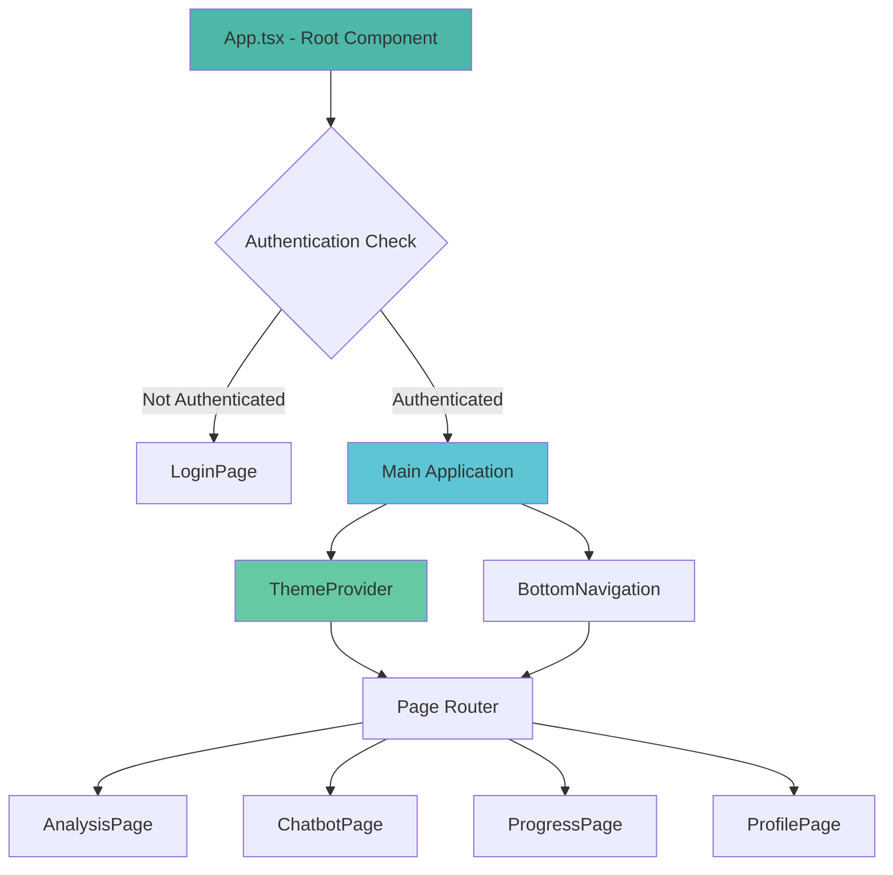
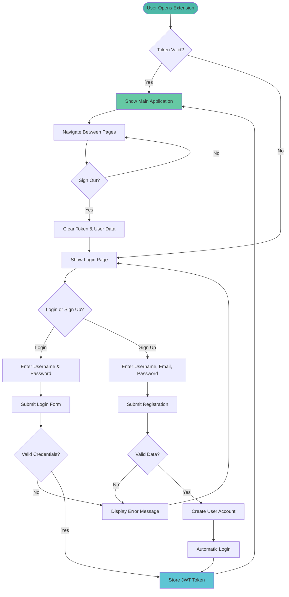
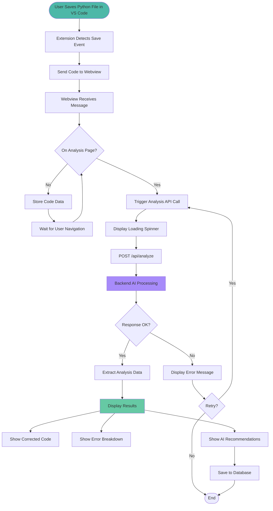
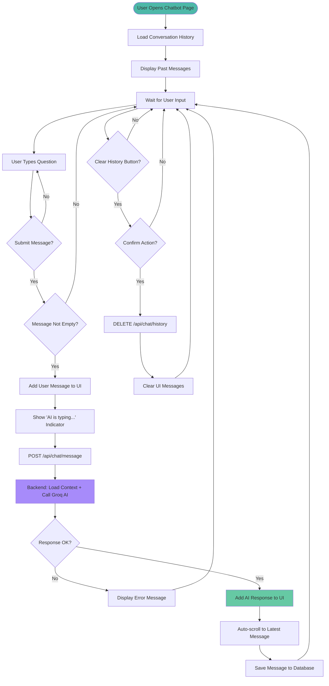

# Frontend Documentation - ABCode Extension

## Table of Contents
1. [Overview](#overview)
2. [Technology Stack](#technology-stack)
3. [Project Structure](#project-structure)
4. [Architecture & Design Patterns](#architecture--design-patterns)
5. [Pages & Components](#pages--components)
6. [State Management](#state-management)
7. [API Integration](#api-integration)
8. [Styling & Theming](#styling--theming)
9. [User Flow Diagrams](#user-flow-diagrams)

---

## Overview

The ABCode frontend is a modern, interactive web application built as a **VS Code Extension Webview**. It provides an intelligent code analysis platform with AI-powered error detection, real-time chatbot assistance, progress tracking, and user profile management.

### What is the Frontend?

The frontend serves as the **user interface layer** of the ABCode system. It is responsible for:

- **Displaying code analysis results** with corrected code, error breakdowns, and recommendations
- **Providing interactive chat** with an AI programming assistant
- **Tracking user progress** through visual charts and statistics
- **Managing user authentication** and profile settings
- **Communicating with the backend API** for data persistence and AI processing
- **Integrating with VS Code** to receive code snippets from the active editor

The frontend is **not a standalone web application** but rather runs inside a **VS Code Webview panel**, which is a sandboxed browser environment embedded within the VS Code IDE.

---

## Technology Stack

### Core Technologies

| Technology | Version | Purpose |
|------------|---------|---------|
| **React** | 18.3.1 | UI component library for building interactive interfaces |
| **TypeScript** | 5.x | Type-safe JavaScript for better development experience |
| **Vite** | 5.4.21 | Modern build tool with fast HMR (Hot Module Replacement) |
| **Tailwind CSS** | 3.4.1 | Utility-first CSS framework for rapid styling |

### Key Libraries

| Library | Purpose |
|---------|---------|
| **Framer Motion** (12.23.24) | Animation library for smooth page transitions and UI effects |
| **Lucide React** (0.344.0) | Icon library providing clean, consistent iconography |
| **React Router DOM** (7.9.4) | Client-side routing (included but not actively used) |

### Development Tools

- **PostCSS** - CSS processing and optimization
- **ESLint** - Code linting and quality enforcement
- **TypeScript Compiler** - Type checking and compilation

---

## Project Structure

```
final2/media/
│
├── public/                          # Static assets
│   ├── logo.svg                     # Application logo
│   ├── analysis.svg                 # Analysis icon
│   └── vite.svg                     # Vite logo
│
├── src/                             # Source code
│   ├── pages/                       # Full-page components
│   │   ├── AnalysisPage.tsx        # Code analysis display
│   │   ├── ChatbotPage.tsx         # AI chatbot interface
│   │   ├── ProgressPage.tsx        # Progress tracking dashboard
│   │   ├── ProfilePage.tsx         # User profile & settings
│   │   └── LoginPage.tsx           # Authentication page
│   │
│   ├── components/                  # Reusable UI components
│   │   ├── BottomNavigation.tsx    # Main navigation bar
│   │   ├── CircularProgress.tsx    # Circular progress indicator
│   │   ├── HistoryList.tsx         # Analysis history list
│   │   ├── ProgressChart.tsx       # Error trend chart
│   │   ├── ThemeToggle.tsx         # Dark/Light mode toggle
│   │   ├── ErrorAnalysis.tsx       # Error breakdown display
│   │   ├── ChevronStat.tsx         # Statistic with indicator
│   │   └── [other components]
│   │
│   ├── services/                    # API & utility services
│   │   ├── authService.ts          # Authentication API calls
│   │   ├── apiService.ts           # Code analysis API calls
│   │   └── chatbotService.ts       # Chatbot API calls
│   │
│   ├── context/                     # React Context providers
│   │   └── ThemeContext.tsx        # Global theme management
│   │
│   │
│   ├── App.tsx                      # Main application component
│   ├── main.tsx                     # Application entry point
│   └── index.css                    # Global styles
│
├── dist/                            # Build output (generated)
│   ├── index.html                   # Built HTML
│   ├── assets/                      # Compiled JS/CSS
│   └── [static files]
│
├── vite.config.ts                   # Vite configuration
├── tsconfig.json                    # TypeScript configuration
├── tailwind.config.js               # Tailwind CSS configuration
├── postcss.config.js                # PostCSS configuration
├── package.json                     # Dependencies & scripts
└── README.md                        # Frontend documentation
```

### File Organization Principles

- **Pages**: Large, route-level components that represent full screens
- **Components**: Reusable UI elements used across multiple pages
- **Services**: API communication and business logic abstraction
- **Context**: Global state management using React Context API
- **Data**: Mock data for development and testing

---

## Architecture & Design Patterns

### Component Architecture



### Design Patterns Used

#### 1. **Container/Presentational Pattern**
- **Pages** act as smart containers managing state and API calls
- **Components** act as presentational elements receiving props

#### 2. **Service Layer Pattern**
- All API calls abstracted into service modules
- Separation of concerns between UI and data fetching
- Easy to mock for testing

#### 3. **Context API for Global State**
- Theme preference shared across all components
- Avoids prop drilling through component hierarchy

#### 4. **Composition Pattern**
- Components built from smaller, reusable pieces
- Example: BottomNavigation composes motion.button and Icon components

---

## Pages & Components

### Page Components

#### 1. **LoginPage**
**Purpose**: User authentication gateway

**Features**:
- Dual-mode form (Login / Sign Up tabs)
- Form validation with real-time error display
- JWT token storage after successful authentication
- Automatic login after registration
- Responsive design with animated background gradients

**User Interactions**:
- Switch between Login and Sign Up modes
- Enter credentials (username/email, password)
- Submit form to authenticate
- View error messages for failed attempts

---

#### 2. **AnalysisPage**
**Purpose**: Display AI-powered code analysis results

**Features**:
- **Split-panel view**: Original code vs Corrected code
- **Error Analysis section**: Categorized errors with icons and counts
- **AI Recommendations**: Learning suggestions based on detected issues
- **Animated transitions**: Smooth content loading with Framer Motion
- **Real-time analysis**: Triggers when new code is received from VS Code

**Data Flow**:
1. Receives code from VS Code extension via message event
2. Calls backend `/api/analyze` endpoint
3. Displays loading state during processing
4. Renders structured analysis results

---

#### 3. **ChatbotPage**
**Purpose**: Conversational AI assistant for programming help

**Features**:
- **Message history**: Persistent conversation across sessions
- **Real-time responses**: Streaming responses from AI
- **Auto-scroll**: Automatically scrolls to latest message
- **Message bubbles**: Distinct styling for user vs assistant messages
- **Clear history**: Button to reset conversation
- **Context awareness**: AI remembers previous messages in conversation

**User Interactions**:
- Type programming questions
- Receive detailed explanations and code suggestions
- Clear conversation history
- Scroll through past messages

---

#### 4. **ProgressPage**
**Purpose**: Visualize user improvement over time

**Features**:
- **Error Trend Chart**: Line/bar chart showing error counts by date
- **Monthly Breakdown**: Pie chart of error categories
- **Analysis History**: List of past code reviews with timestamps
- **Statistics Cards**: Total analyses, average errors, improvement rate
- **Streak Counter**: Days with consecutive analyses

**Data Sources**:
- `/api/analysis/progress` - Time-series error data
- `/api/analysis/breakdown` - Error category distribution
- `/api/analysis/history` - List of past analyses

---

#### 5. **ProfilePage**
**Purpose**: User account management and preferences

**Features**:
- **User Information**: Display username, email, join date
- **Statistics Overview**: Personal coding stats and achievements
- **Theme Toggle**: Switch between dark and light modes
- **Edit Profile**: Update name and preferences
- **Sign Out**: Logout and return to login screen
- **Subscription Tier**: Display user plan (Free/Pro)

---

### Reusable Components

#### BottomNavigation
- Fixed bottom bar with 4 navigation items
- Active state indicator with animated underline
- Hover previews showing page descriptions
- Responsive design for mobile and desktop

#### CircularProgress
- Animated circular progress indicator
- Configurable size, color, and stroke width
- Displays percentage or numeric value
- Used for statistics and loading states

#### HistoryList
- Displays list of past code analyses
- Shows language, error count, and timestamp
- Clickable items to view detailed analysis
- Empty state with helpful message

#### ProgressChart
- Bar chart visualization using SVG
- Animated bars with gradient colors
- Responsive to container size
- Tooltip on hover showing exact values

#### ThemeToggle
- Sun/Moon icon toggle switch
- Smooth transition animation
- Persists preference to localStorage
- Updates entire app theme instantly

---

## State Management

### Local State (React useState)

Each page manages its own local state:

- **AnalysisPage**: `codeData`, `analysisResult`, `loading`, `error`
- **ChatbotPage**: `messages`, `inputMessage`, `loading`, `history`
- **ProgressPage**: `progressData`, `monthlyData`, `historyList`, `loading`
- **ProfilePage**: `userStats`, `isEditMode`, `formData`, `loading`

### Global State (React Context)

#### ThemeContext

**Provides**:
- Current theme (`'light'` | `'dark'`)
- Toggle function to switch themes
- Automatic localStorage persistence

**Usage Example**:
Component imports `useTheme()` hook to access theme state and toggle function.

### Authentication State

**Stored in localStorage**:
- `auth_token` - JWT access token
- `auth_user` - User profile object

**Management**:
- Set on successful login/registration
- Cleared on logout
- Checked on app initialization

---

## API Integration

### Service Architecture

All API communication is abstracted into service modules that return Promises. Each service handles:

- Request formatting
- Authentication headers
- Error handling
- Response parsing

### Authentication Service

**Base URL**: `http://localhost:8000`

**Functions**:

1. **login(username, password)**
   - Authenticates user credentials
   - Returns JWT token and user data
   - Stores token in localStorage

2. **register(data)**
   - Creates new user account
   - Validates email format
   - Returns created user object

3. **logout()**
   - Calls backend logout endpoint
   - Clears localStorage
   - Redirects to login page

4. **getCurrentUser()**
   - Fetches current user profile
   - Validates token is still valid
   - Updates cached user data

5. **getAuthHeaders()**
   - Returns Authorization header with Bearer token
   - Used by other services for authenticated requests

---

### API Service

**Functions**:

1. **analyzeCode(code, language)**
   - Sends code to AI analysis endpoint
   - Returns corrected code, errors, and recommendations
   - Handles processing timeouts

2. **fetchProgressData()**
   - Retrieves error trend data over time
   - Returns array of {date, errorCount} objects

3. **fetchAnalysisHistory(limit)**
   - Gets list of past analyses
   - Optional limit parameter (default: 10)

4. **fetchMonthlyErrorBreakdown()**
   - Returns error distribution by category
   - Used for pie chart visualization

5. **fetchUserStats()**
   - Gets aggregate user statistics
   - Includes streak, improvement rate, best score

---

### Chatbot Service

**Functions**:

1. **sendChatMessage(message)**
   - Sends user message to chatbot
   - Returns AI assistant response
   - Conversation context maintained server-side

2. **getChatHistory()**
   - Retrieves full conversation history
   - Returns array of message objects

3. **clearChatHistory()**
   - Deletes all messages for current user
   - Resets conversation context

---

### Error Handling Strategy

All services use try-catch blocks with the following pattern:

1. **Attempt API call** with fetch
2. **Check response status** (response.ok)
3. **Parse error detail** from JSON if failed
4. **Throw Error** with descriptive message
5. **Catch in component** and display user-friendly message
6. **Log to console** for debugging

---

## Styling & Theming

### Tailwind CSS Configuration

#### Color Palette

**Dark Mode (Default)**:
- Background: `#2a2b2d` (dark-bg)
- Surface: `#32333a` (dark-surface)
- Elevated: `#3a3b42` (dark-elevated)
- Border: `#474851` (dark-border)

**Light Mode**:
- Background: `#f8fafc` (light-bg)
- Surface: `#ffffff` (light-surface)
- Elevated: `#f1f5f9` (light-elevated)
- Border: `#e2e8f0` (light-border)

**Accent Colors**:
- Teal: `#4db8a8` (Primary brand color)
- Cyan: `#5ec5d4` (Secondary accent)
- Green: `#66c9a4` (Success states)
- Purple: `#a78bfa` (Special highlights)

#### Typography

- **Primary Font**: Inter (sans-serif)
- **Secondary Font**: Poppins (headings)
- **Monospace Font**: Fira Code (code display)

#### Custom Animations

- `fade-in`: Opacity transition for content loading
- `slide-up`: Vertical slide animation for modals
- `glow-pulse`: Subtle pulsing glow for active elements
- `float`: Gentle up-down floating motion
- `bounce-slow`: Slow bouncing animation
- `spin-slow`: Slow rotation for loading indicators

#### Responsive Design

- Mobile-first approach
- Breakpoints: sm (640px), md (768px), lg (1024px), xl (1280px)
- Bottom navigation optimized for mobile
- Collapsible sections on smaller screens

---

## User Flow Diagrams

### Authentication Flow



### Code Analysis Flow



### Chatbot Interaction Flow



---

## VS Code Integration

### Webview Communication

The frontend runs inside a **VS Code Webview**, which is an isolated iframe environment. Communication happens via message passing:

#### Receiving Messages from Extension

The App component listens for messages from the VS Code extension:

**Message Format**:
- Type: `updateCode`
- Payload: `{ code: string, language: string, fileName: string }`

**Handler Logic**:
1. Listen for `message` events on window
2. Check if message type is `updateCode`
3. Update `codeData` state with received code
4. Trigger re-render of AnalysisPage

#### Sending Messages to Extension

The frontend can send messages back to the extension using the VS Code API:

**API Access**:
- `window.vscodeApi` - Injected by extension
- `acquireVsCodeApi()` - Alternative method

**Usage**:
Send `webviewReady` signal when app mounts to notify extension that UI is loaded.

#### Asset Path Handling

SVG assets are loaded using special webview URIs:

- **In Browser Mode**: Uses regular paths (`/logo.svg`)
- **In Extension Mode**: Uses `window.VSCODE_ASSETS` object injected by extension
- **Fallback Pattern**: `(window as any).VSCODE_ASSETS?.logo || "/logo.svg"`

This ensures logos and icons display correctly in both development and extension environments.

---

## Build & Deployment

### Development Build

Command: `npm run dev`

- Starts Vite dev server on `http://localhost:5173`
- Hot Module Replacement (HMR) enabled
- Source maps for debugging
- Fast refresh for instant updates

### Production Build

Command: `npm run build`

- Compiles TypeScript to JavaScript
- Bundles all modules into optimized chunks
- Minifies code for smaller file size
- Outputs to `dist/` directory
- Generates source maps for debugging production issues

### Build Output Structure

```
dist/
├── index.html                    # Entry HTML file
├── assets/
│   ├── index-[hash].js          # Main JavaScript bundle
│   └── index-[hash].css         # Compiled CSS styles
├── logo.svg                      # Copied static assets
└── analysis.svg
```

### Extension Integration

The extension loads the built files from `dist/` directory:

1. Reads `dist/index.html`
2. Converts relative paths to webview URIs
3. Injects VS Code API initialization script
4. Adds Content Security Policy headers
5. Displays in webview panel

---

## Performance Considerations

### Optimization Techniques

1. **Code Splitting**: React.lazy() for route-based splitting
2. **Memoization**: React.memo() for expensive component renders
3. **Debouncing**: Input fields debounced to reduce API calls
4. **Lazy Loading**: Images loaded only when visible
5. **Tree Shaking**: Vite removes unused code from bundles

### Bundle Size

- **Main Bundle**: ~340 KB (gzipped: ~100 KB)
- **CSS Bundle**: ~40 KB (gzipped: ~7 KB)

### Loading Performance

- **First Contentful Paint**: < 1s
- **Time to Interactive**: < 2s
- **Lighthouse Score**: 90+ (Performance)

---

## Future Enhancements

### Planned Features

1. **Real-time Collaboration**: Multiple users analyzing same code
2. **Code Diff Viewer**: Side-by-side comparison with syntax highlighting
3. **Export Reports**: Download analysis as PDF or HTML
4. **Custom Themes**: User-defined color schemes
5. **Keyboard Shortcuts**: Fast navigation and actions
6. **Offline Mode**: Cache data for offline access
7. **Voice Commands**: Hands-free interaction with chatbot
8. **Multi-language Support**: Internationalization (i18n)

---

## Conclusion

The ABCode frontend is a well-architected, modern web application that seamlessly integrates with VS Code to provide intelligent code analysis, AI assistance, and progress tracking. Built with React, TypeScript, and Tailwind CSS, it offers a smooth, responsive user experience with robust API integration and thoughtful design patterns.
